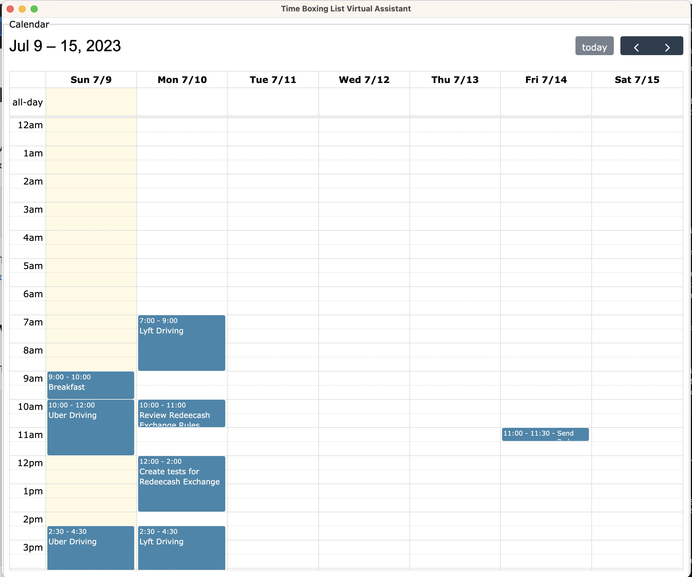
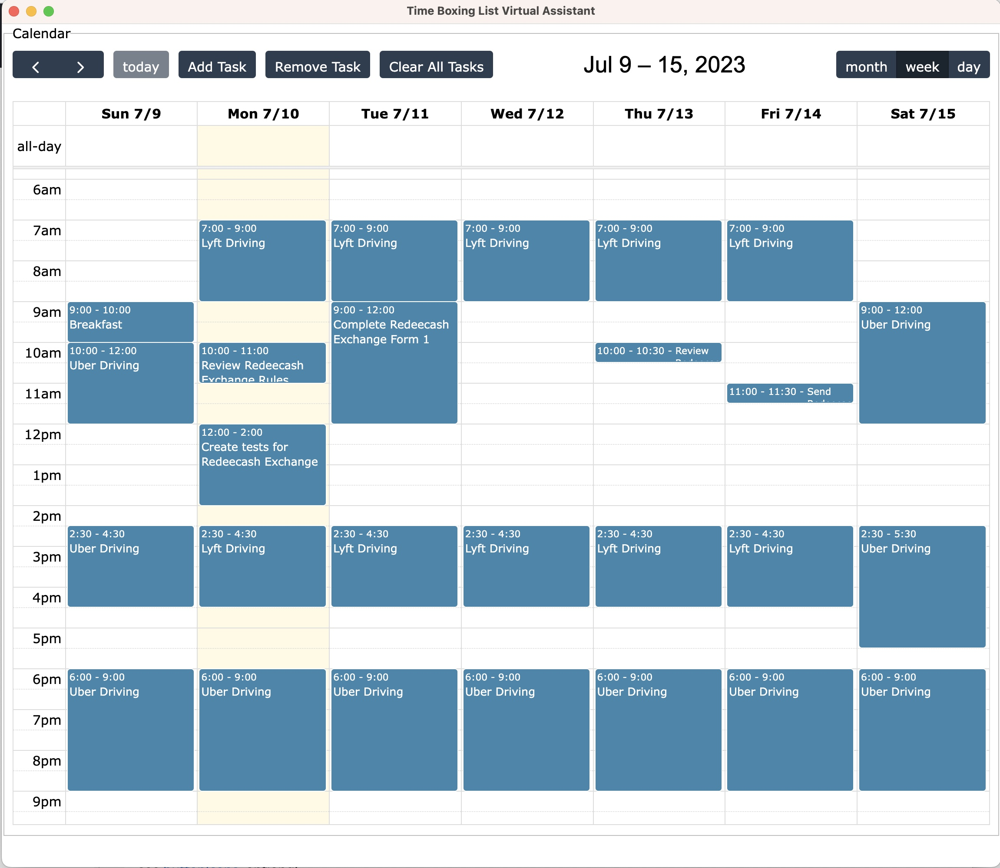

# Timeboxing Virtual Assistant

Timeboxing is a time management technique that involves allocating specific time periods, called time boxes, for completing tasks or activities. It is a structured approach to managing time and improving productivity by setting clear boundaries and focusing on one task at a time.

The key principle of timeboxing is to work within a fixed time frame for each task, without allowing it to spill over or exceed the allocated time. This creates a sense of urgency and helps prevent procrastination, as the time constraint encourages individuals to stay focused and complete the task within the defined timeframe.

Here are the key elements of timeboxing:

1. Fixed time duration: Each task or activity is assigned a predetermined duration or time box. This can range from a few minutes to several hours, depending on the nature and complexity of the task.
2. Clear objectives: Before starting a time box, it is essential to have a clear understanding of what needs to be accomplished within that specific timeframe. Setting clear objectives and goals helps maintain focus and ensures progress towards desired outcomes.
3. Prioritization: Timeboxing requires prioritizing tasks and deciding which ones are most important or urgent. By allocating dedicated time slots to specific tasks, you ensure that crucial activities receive the necessary attention and avoid wasting time on less important matters.
4. Intense focus: During the time box, it is crucial to eliminate distractions and concentrate solely on the task at hand. This means avoiding interruptions, turning off notifications, and creating an environment conducive to productivity.
5. Acceptance of incomplete tasks: If a task is not completed within the allocated time box, it is typically moved to a later time slot or reevaluated for priority. The aim is to accept that not all tasks can be fully accomplished within a fixed timeframe and to adjust accordingly without impacting the overall workflow.

Benefits of timeboxing include:

- Enhanced productivity: The structured approach of timeboxing promotes focused work and reduces time wasted on unimportant or non-value-added tasks.
- Improved time management: By setting specific time limits for each task, individuals can better plan and allocate their time, making it easier to stay on track and meet deadlines.
- Increased motivation: The time constraint of timeboxing creates a sense of urgency and can boost motivation by providing a clear target and deadline for completing tasks.
- Better task estimation: Over time, practicing timeboxing helps individuals develop a better understanding of task durations and improves their ability to estimate how long different activities will take.

Overall, timeboxing is a valuable technique for managing time effectively, staying focused, and achieving productivity. By breaking tasks into smaller, manageable time boxes, individuals can work with greater efficiency, make progress on their goals, and maintain a healthy work-life balance.

## Example

Version 1.0.0

Version 1.1.0

The above time boxing as a ride share driver, generates a consistent gross income of $500 per week for the corporation. The following book describes How to Start a company and grow into a Corporate Giant, with Part 2 (coming soon) for steps to take your newly formed company public. Download the book at [https://www.amazon.com/dp/B00NAZ2226](https://www.amazon.com/dp/B00NAZ2226)

Learn more at [floridaridesharedriver.com](https://floridaridesharedriver.com)

## Migrating from TODO Lists

Migrating from traditional to-do lists to time boxing can be a beneficial shift in managing your tasks and increasing productivity. Here are some steps to help you get started with time boxing:

1. Understand your tasks: Begin by reviewing your existing to-do list and categorize the tasks based on priority, urgency, and complexity. Identify the key activities that require your attention and determine their relative importance.
2. Set time box durations: Decide on the duration of each time box based on the nature of your tasks and personal preferences. It can be helpful to start with shorter time boxes, such as 25 or 30 minutes (known as the Pomodoro Technique), and gradually adjust the duration as you become more comfortable with time boxing.
3. Prioritize tasks: Prioritize your tasks based on their importance and urgency. Identify the critical tasks that must be completed within a given time frame and assign them to specific time boxes. Be realistic and allocate enough time to complete each task effectively.
4. Create a schedule: Create a schedule or calendar that outlines your time boxes for the day or week. You can use a physical planner, a digital calendar, or productivity apps to organize and visualize your time blocks. Ensure that you allocate buffer time between tasks to account for breaks or unforeseen circumstances. **Using the Timeboxing Virtual Assistant for this task.**
5. Focus on one task at a time: During each time box, commit to working exclusively on the assigned task. Minimize distractions, such as turning off notifications or finding a quiet workspace. Concentrate solely on the task without multitasking or switching between unrelated activities.
6. Track your progress: Use a timer or stopwatch to keep track of the time box duration. This helps maintain accountability and ensures that you stay within the allocated time frame. It also provides insights into your productivity and helps refine your timeboxing approach over time.
7. Evaluate and adjust: After completing each time box, take a moment to evaluate your progress. Reflect on whether you accomplished the desired outcome and if any adjustments are needed for future time boxes. Use this feedback to refine your scheduling and improve your time management skills.
8. Embrace flexibility: Timeboxing does not mean rigidly sticking to the schedule at all costs. Be open to adjusting your time boxes if unexpected circumstances arise or if you realize a task requires more time than initially allocated. Adaptability is key to finding a balance between structure and adaptiveness.
9. Iterate and improve: As you gain experience with timeboxing, continually assess its effectiveness for your workflow. Experiment with different durations, techniques, and tools to find what works best for you. Adapt the process as needed and make incremental improvements over time.

Remember, the transition from to-do lists to time boxing requires practice and adjustment. Be patient with yourself as you adapt to this new approach and find your rhythm. With consistency and perseverance, timeboxing can help you increase productivity, manage your tasks more effectively, and accomplish your goals more efficiently.

### Example

Original To-Do List:

1. Write report
2. Respond to emails
3. Prepare presentation
4. Review project proposal
5. Call client

Migration to Timeboxing:

1. Set Time Box Durations:

   - Decide to start with 30-minute time boxes.
2. Prioritize Tasks:

   - Write report (Priority: High)
   - Respond to emails (Priority: Medium)
   - Prepare presentation (Priority: High)
   - Review project proposal (Priority: Medium)
   - Call client (Priority: Low)
3. Create a Schedule:

   - 9:00 AM - 9:30 AM: Time Box 1: Write report
   - 9:30 AM - 10:00 AM: Time Box 2: Respond to emails
   - 10:00 AM - 10:30 AM: Time Box 3: Prepare presentation
   - 10:30 AM - 11:00 AM: Time Box 4: Review project proposal
   - 11:00 AM - 11:30 AM: Time Box 5: Call client
4. Focus on One Task at a Time:

   - During each time box, give your complete attention to the assigned task.
   - For example, during Time Box 1 (9:00 AM - 9:30 AM), solely focus on writing the report without getting distracted.
5. Track Your Progress:

   - Use a timer or stopwatch to ensure you stay within the allocated time for each task.
   - Start the timer at the beginning of each time box and stop it when the time is up.
6. Evaluate and Adjust:

   - After each time box, evaluate your progress and task completion.
   - If a task is not fully completed, assess whether it requires additional time in the next time box or if it needs to be reprioritized.
7. Adapt and Iterate:

   - Over time, adjust the time box durations based on your experience and task requirements.
   - Experiment with different durations, such as shorter or longer time boxes, to find what works best for you.

Remember, this is just an example, and you can adapt the timeboxing technique based on your specific tasks, priorities, and time constraints. It may take some trial and error to find the ideal approach that suits your workflow and helps you maximize productivity.
